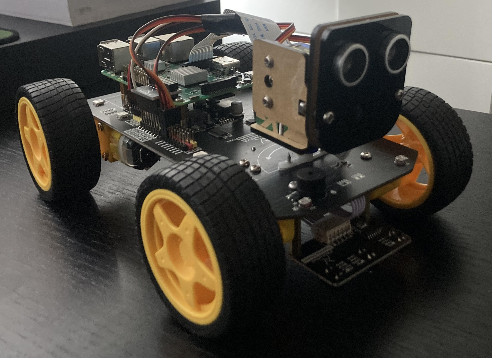

## SmartCar
Combine the Freenove 4WD Smart Car for Raspberry Pi with various AI blocks.  

### Project 1: Room 3D model
The first project is implement a room exploration algorithm coupled with obstacle avoidance to avoid crashing the car. Once the room explored the output should be a video of the room, this will then be fed to Neuralangelo (https://github.com/NVlabs/neuralangelo) to build a 3D surface model of my room.

- [x] Freenove 4WD Smart Car built
- [x] Raspberry Pi 3 configuration completed
- [x] Car sensors tested (image, obstacle distance, sound and led)
- [ ] Obstacle avoidance algorithm
- [ ] Room exploration algorithm
- [ ] Use Neuralangelo to build a 3D surface model of my room with the video taken from the car
